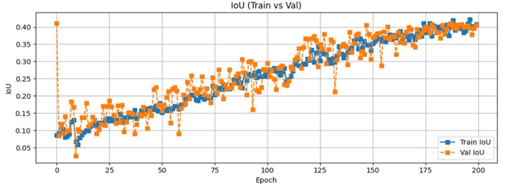
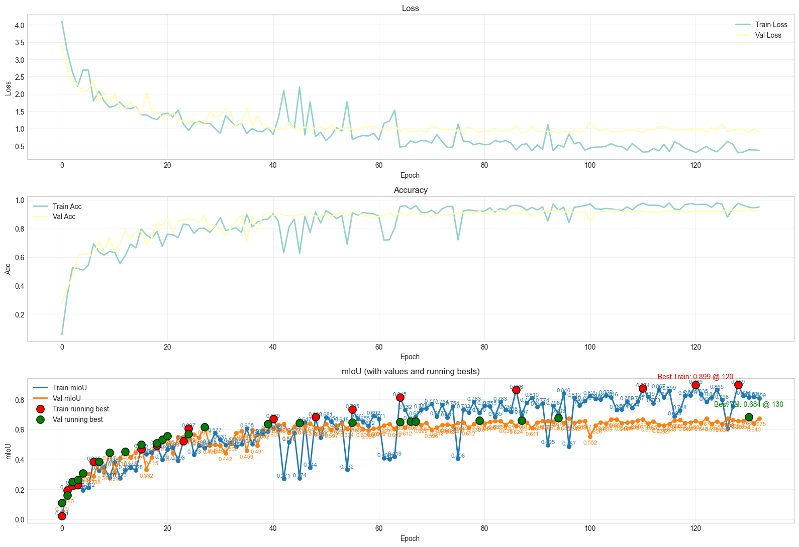
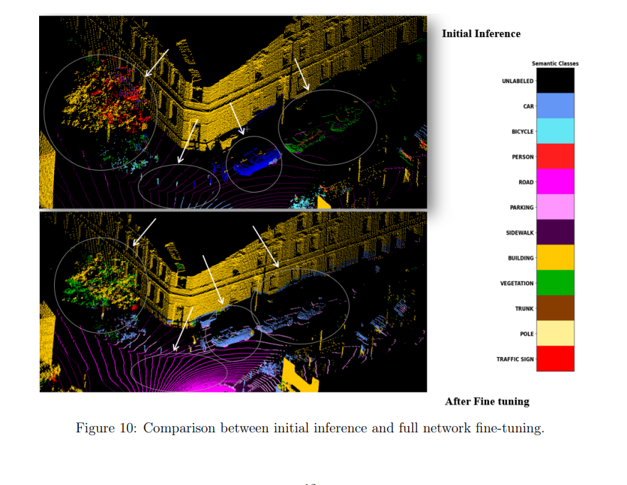

# LiDAR Semantic Segmentation: SalsaNext Domain Adaptation

Deep-learning semantic segmentation of mobile LiDAR point clouds, adapting a SalsaNext model from the SemanticKITTI benchmark (Velodyne HDL-64E) to real urban data captured with the IKG Mobile Mapping Cargo E-Bike in Hannover, Germany. The model was fine-tuned on a small manually annotated set of Ouster OS1-128 scans to bridge the sensor domain gap between benchmark training data and real-world measurements.

*Per-class IoU before and after fine-tuning. Large structural classes improve substantially, while thin, sparse classes remain challenging.*

This was a group project seminar at the Institute of Cartography and Geoinformatics (IKG), Leibniz University Hannover. My primary contributions were the **Ouster-to-SemanticKITTI data preparation pipeline** and the **SalsaNext fine-tuning and evaluation** (projection setup, training runs, IoU and confusion-matrix analysis), within a seven-person team that also evaluated a second model (RangeViT).

## Key results

- Validation mean IoU improved to **0.69** after fine-tuning on only **38 annotated scans**
- Road IoU improved from **0.14 to 0.87**, car from **0.44 to 0.93**, sidewalk from **0.39 to 0.91**
- Building remained strong (**0.84 to 0.91**), confirming large planar structures transfer well across sensors
- Parking recovered from **0.05 to 0.65** and trunk from **0.04 to 0.43** through domain adaptation
- Honest limitation: thin classes declined (**pole 0.18 to 0.11**, **traffic sign 0.14 to 0.04**), as fine-tuning on a small imbalanced set shifted the model toward dominant classes

## Pipeline overview

1. **Data preparation** — Ouster OS1-128 mobile LiDAR bags converted into SemanticKITTI-format `.bin` scans (x, y, z, remission), handling PointCloud2 field layout, padding, endianness, and invalid-point filtering
2. **Manual annotation** — 38 representative scans labelled in Segments.ai, with at least 90% of each scan annotated for training stability
3. **Fine-tuning** — SemanticKITTI-pretrained SalsaNext adapted to the IKG domain, with class-weighted cross-entropy, an ignored unlabeled class, and range-image projection parameterised for the Ouster OS1-128 field of view (128 x 2048)
4. **Evaluation** — per-class IoU, confusion-matrix analysis, and pretrained-vs-fine-tuned comparison across twelve semantic classes, with checkpoint selection on best validation mIoU

## Figures

*Full-network confusion matrix across twelve classes. Strong diagonal for dominant structural classes; confusion concentrated among thin and geometrically similar classes (bicycle vs fence, pole vs building).*

*Loss, accuracy, and mIoU across fine-tuning epochs. Steady convergence with a persistent train-validation mIoU gap characteristic of small LiDAR annotation sets.*

*Point cloud segmentation before and after fine-tuning. Cleaner class boundaries and more coherent structural segmentation after domain adaptation.*

## Methods and tools

Python, NumPy, PyTorch. SalsaNext (Cortinhal et al., 2020) for range-image-based LiDAR semantic segmentation, fine-tuned from SemanticKITTI-pretrained weights. Ouster ROS1/ROS2 bag decoding via `rosbags`. Range-image projection for the Ouster OS1-128 sensor geometry. Segments.ai for manual point cloud annotation. The SalsaNext model and training code are the original authors' work (see Reference); this repository contributes the data pipeline, sensor-specific configuration, and evaluation around it.

## Repository contents

- `scripts/bag_to_semantickitti_bin_rosbags.py` — converts Ouster ROS1/ROS2 bags into SemanticKITTI-format `.bin` scans, reconstructing exact PointCloud2 layout with padding and endianness handling, datatype-aware remission scaling, and invalid-point filtering
- `configs/ouster_os1_128.yaml` — range-image projection and class-mapping settings for the Ouster OS1-128 sensor
- `figures/` — evaluation figures (per-class IoU, confusion matrix, training curves, qualitative comparison)

The SalsaNext model and training code are not vendored here; use the original repository (see Reference) and point it at the data produced by the converter.

## Reference

Cortinhal, T., Tzelepis, G., Aksoy, E. E. (2020). *SalsaNext: Fast, Uncertainty-aware Semantic Segmentation of LiDAR Point Clouds for Autonomous Driving.* arXiv:2003.03653. Repository: https://github.com/TiagoCortinhal/SalsaNext

Behley, J., Garbade, M., Milioto, A., Quenzel, J., Behnke, S., Stachniss, C., Gall, J. (2019). *SemanticKITTI: A Dataset for Semantic Scene Understanding of LiDAR Sequences.* ICCV 2019. arXiv:1904.01416.
